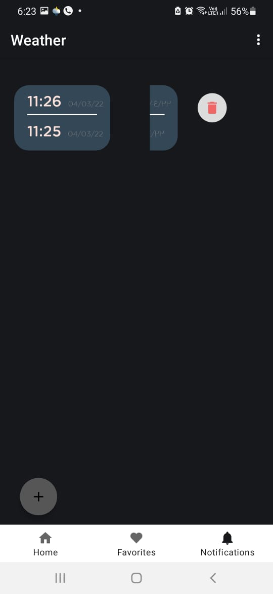
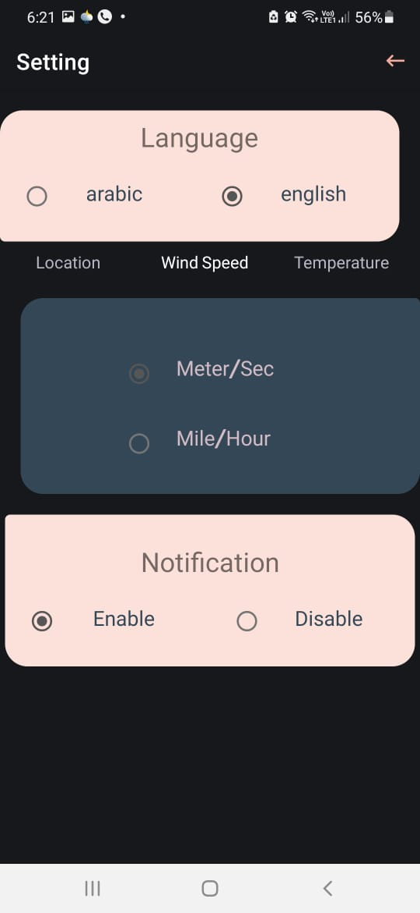

# weather-app-

 weather-app- is a simple weather forecast app, which uses some APIs to fetch 7 day forecast data from the OpenWeatherMap Api and to fetch places,cities,counties,coords etc. from Geocoder  Provides Weather information (clear sky , light rain .. etc.) and weather information throughout the day , can change units, wind speed and Language can choose favorite locations using map or location or search inGoogle Place API and can add weather alert to warning about the weather 
 
## Requirements 

Android studio last version  
JDK 8  
Android SDK 32  
Supports API Level +26

## Highlights
Use OpenWeatherMap API
Support two language. English & Arabic
Use locale Database

 
## Video Preview <a href="https://www.linkedin.com/posts/tarek-elmorsy-14a76916b_kotlin-mvvm-retrofit-activity-6900237329361981440-Eg64?utm_source=linkedin_share&utm_medium=member_desktop_web">video link</a>

## Screenshot
   
  
   
   
   
   
 
 

## Libraries and tools 🛠

Navigation  
Shared Preferences  
viewModel  
LiveData  
coroutine  
View Binding  
RoomDB  
Retrofit  
OkHttp  
Glide  
Material Design
Notification

